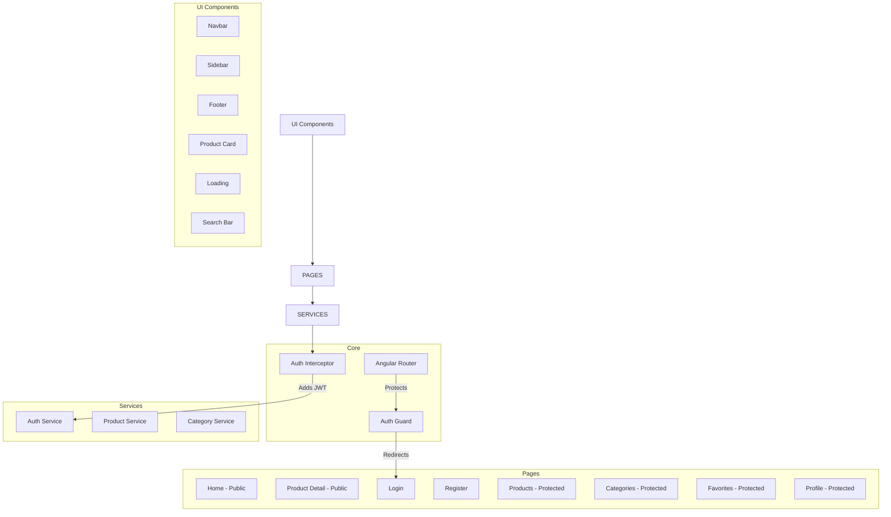
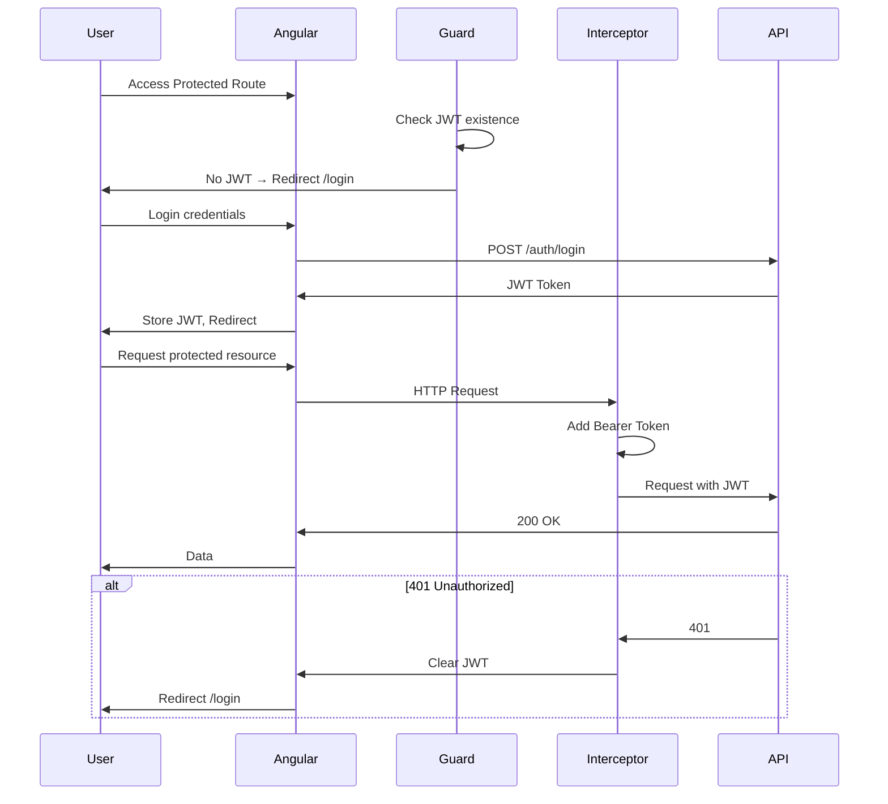

# Team Centinela - Product Management System

Angular 22 application for product management with authentication, consuming a REST API.

## 👥 Team

| Name | Role |
|------|------|
| Santiago Diaz Mayorquin | Frontend Developer |
| Jeronimo Torres | Frontend Developer |
| Santiago Sanchez | Frontend Developer |
| Juliana Sofia Valencia | Frontend Developer |
| Sebastian Torres | Frontend Developer |

### Assignment owner
- Carlos D. Castaño, Team Lead 

## 🛠 Technologies

- **Framework:** Angular 22
- **Language:** TypeScript
- **Styling:** CSS/SCSS
- **HTTP Client:** Angular HttpClient
- **Authentication:** JWT (JSON Web Tokens)
- **Package Manager:** npm

## 📁 Project Architecture



## 🔐 Authentication Flow



## ✨ Features

### Public Features
- **Home** - Product listing with search and category filter
- **Product Detail** - Full product information with images
- **Login/Register** - User authentication

### Protected Features (Require Authentication)
- **Products Management** - Full CRUD operations
- **Categories Management** - Full CRUD operations
- **Favorites** - User's favorite products
- **Profile** - User info and password change
- **Logout** - Session termination

## 📦 API Endpoints

| Method | Endpoint | Description | Auth |
|--------|----------|-------------|------|
| GET | `/products` | List all products | No |
| GET | `/products?search=` | Search products | No |
| GET | `/products/:id` | Product detail | No |
| POST | `/products` | Create product | Yes |
| PATCH | `/products/:id` | Update product | Yes |
| DELETE | `/products/:id` | Delete product | Yes |
| GET | `/categories` | List categories | No |
| POST | `/categories` | Create category | Yes |
| PATCH | `/categories/:id` | Update category | Yes |
| DELETE | `/categories/:id` | Delete category | Yes |
| GET | `/favorites` | User favorites | Yes |
| POST | `/favorites/:productId` | Add favorite | Yes |
| DELETE | `/favorites/:productId` | Remove favorite | Yes |
| GET | `/users/me` | Current user | Yes |
| PATCH | `/users/me/password` | Change password | Yes |
| POST | `/auth/login` | Login | No |
| POST | `/auth/register` | Register | No |
| POST | `/auth/logout` | Logout | Yes |

## 🚀 Installation & Running

```bash
# Install dependencies
npm install

# Run development server
npm start

# Build for production
npm run build
```

The application runs on `http://localhost:4200`

## 📡 API Configuration

The application connects to the Product Management API (NestJS) running locally.

**API Repository:** [gestion-de-productos](https://github.com/carlosdcastano/gestion-de-productos.git)

> The backend is included as a git subtree in `backend/` directory. See [CONTRIBUTING.md](./CONTRIBUTING.md) for subtree management.

## 📂 Project Structure

```
src/app/
├── pages/              # Page components (routes)
│   ├── home/
│   ├── login/
│   ├── register/
│   ├── products/
│   ├── categories/
│   ├── favorites/
│   └── profile/
├── components/         # Reusable UI components
│   ├── layout/
│   │   ├── navbar/
│   │   ├── sidebar/
│   │   └── footer/
│   └── ui/
│       ├── product-card/
│       ├── loading/
│       └── search-bar/
├── services/           # API communication
│   ├── auth.service.ts
│   ├── product.service.ts
│   └── category.service.ts
├── guards/             # Route protection
│   └── auth.guard.ts
├── interceptors/       # HTTP interceptors
│   └── auth.interceptor.ts
├── models/             # TypeScript interfaces
└── app.routes.ts       # Route configuration
```


