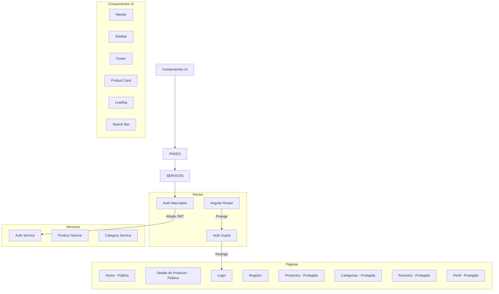
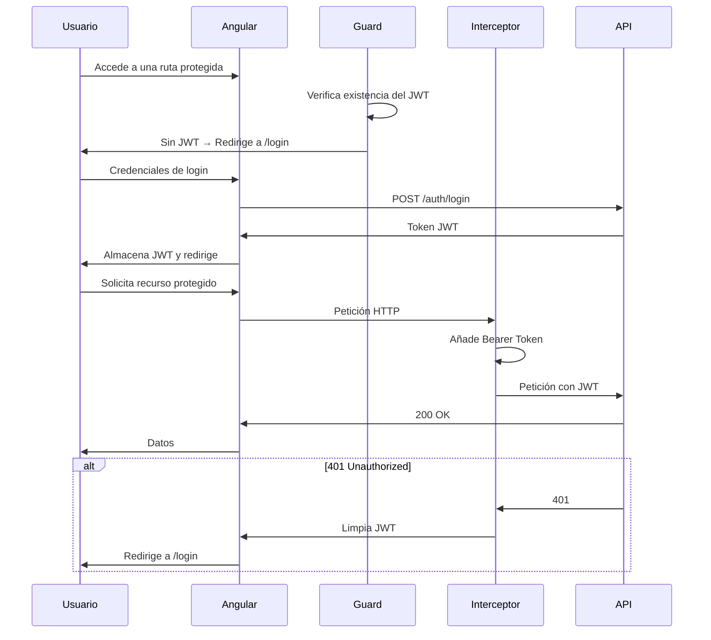

# Team Centinela - Sistema de Gestión de Productos

Aplicación web fullstack para la gestión de productos con autenticación, que consume una API REST.

## 👥 Equipo

| Nombre | Rol |
|--------|-----|
| Santiago Diaz Mayorquin | Desarrollador Frontend |
| Jeronimo Torres | Desarrollador Frontend |
| Santiago Sanchez | Desarrollador Frontend |
| Juliana Sofia Valencia | Desarrollador Frontend |
| Sebastian Torres | Desarrollador Frontend |

### Responsable del encargo
- Carlos D. Castaño, Team Lead

## 🛠 Tecnologías

### Frontend
- **Framework:** Angular 18
- **Lenguaje:** TypeScript
- **Estilos:** CSS/SCSS, Bootstrap
- **Cliente HTTP:** Angular HttpClient
- **Autenticación:** JWT (JSON Web Tokens)
- **Gestor de paquetes:** npm

### Backend
- **Framework:** NestJS
- **Lenguaje:** TypeScript
- **ORM:** Prisma / TypeORM (según implementación en `backend/`)
- **Autenticación:** JWT
- **Gestor de paquetes:** npm

### Base de datos
- **PostgreSQL** gestionado con Supabase

### Infraestrutura
- **Docker** y **docker-compose** para orquestación de contenedores

## 📁 Arquitectura del proyecto



## 🔐 Flujo de autenticación



## ✨ Funcionalidades

### Públicas
- **Home** - Listado de productos con búsqueda y filtro por categoría
- **Detalle de Producto** - Información completa del producto con imágenes
- **Login / Registro** - Autenticación de usuarios

### Protegidas (requieren autenticación)
- **Gestión de Productos** - Operaciones CRUD completas
- **Gestión de Categorías** - Operaciones CRUD completas
- **Favoritos** - Productos favoritos del usuario
- **Perfil** - Información del usuario y cambio de contraseña
- **Logout** - Cierre de sesión

## 📦 Endpoints de la API

| Método | Endpoint | Descripción | Auth |
|--------|----------|-------------|------|
| POST | `/auth/login` | Iniciar sesión | No |
| POST | `/auth/register` | Registrar usuario | No |
| POST | `/auth/logout` | Cerrar sesión | Sí |
| GET | `/products` | Listar productos | No |
| GET | `/products?search=` | Buscar productos | No |
| GET | `/products/:id` | Detalle de producto | No |
| POST | `/products` | Crear producto | Sí |
| PATCH | `/products/:id` | Actualizar producto | Sí |
| DELETE | `/products/:id` | Eliminar producto | Sí |
| GET | `/categories` | Listar categorías | No |
| POST | `/categories` | Crear categoría | Sí |
| PATCH | `/categories/:id` | Actualizar categoría | Sí |
| DELETE | `/categories/:id` | Eliminar categoría | Sí |
| GET | `/favorites` | Favoritos del usuario | Sí |
| POST | `/favorites/:productId` | Añadir favorito | Sí |
| DELETE | `/favorites/:productId` | Quitar favorito | Sí |
| GET | `/users/me` | Usuario actual | Sí |
| PATCH | `/users/me/password` | Cambiar contraseña | Sí |

**Documentación interactiva (Swagger):** `http://localhost:3000/api/docs`

## 🚀 Instalación

### Backend

```bash
cd backend
npm install
```

### Frontend

```bash
cd frontend
npm install
```

## ▶️ Ejecución

### Sin Docker

**Backend:**
```bash
cd backend
npm run start:dev
```

**Frontend:**
```bash
cd frontend
npm start
```

### Con Docker

```bash
docker-compose up --build
```

## 🌐 URLs por defecto

- **Frontend:** http://localhost:4200
- **Backend:** http://localhost:3000
- **Swagger (documentación API):** http://localhost:3000/api/docs

## 🗄️ Base de datos

Se utiliza **Supabase** (PostgreSQL gestionado). La configuración de conexión se encuentra en el archivo `backend/.env`:

```
DATABASE_URL=postgresql://<usuario>:<contraseña>@<host>:<puerto>/postgres
JWT_SECRET=<secreto-del-equipo>
JWT_EXPIRES_IN=1d
```

## ⚙️ Configuración de la API

El frontend se conecta al backend NestJS a través del proxy configurado en `frontend/proxy.conf.json`, que resuelve las llamadas a `/api` hacia `http://localhost:3000`. En caso de necesitar cambiar la URL base, modificar los archivos de entorno en `frontend/src/environments/`.

## 📂 Estructura del proyecto

```
.
├── backend/                    # API NestJS
│   ├── src/
│   ├── Dockerfile
│   └── package.json
├── frontend/                   # Aplicación Angular 18
│   ├── src/
│   │   └── app/
│   │       ├── pages/          # Componentes de página (rutas)
│   │       │   ├── home/
│   │       │   ├── login/
│   │       │   ├── register/
│   │       │   ├── products/
│   │       │   ├── categories/
│   │       │   ├── favorites/
│   │       │   └── profile/
│   │       ├── components/     # Componentes UI reutilizables
│   │       │   ├── layout/
│   │       │   │   ├── navbar/
│   │       │   │   ├── sidebar/
│   │       │   │   └── footer/
│   │       │   └── ui/
│   │       │       ├── product-card/
│   │       │       ├── loading/
│   │       │       └── search-bar/
│   │       ├── services/       # Comunicación con la API
│   │       │   ├── auth.service.ts
│   │       │   ├── product.service.ts
│   │       │   └── category.service.ts
│   │       ├── guards/         # Protección de rutas
│   │       │   └── auth.guard.ts
│   │       ├── interceptors/   # Interceptores HTTP
│   │       │   └── auth.interceptor.ts
│   │       ├── models/         # Interfaces TypeScript
│   │       └── app.routes.ts   # Configuración de rutas
│   ├── Dockerfile
│   └── package.json
├── docker-compose.yml
└── README.md
```
