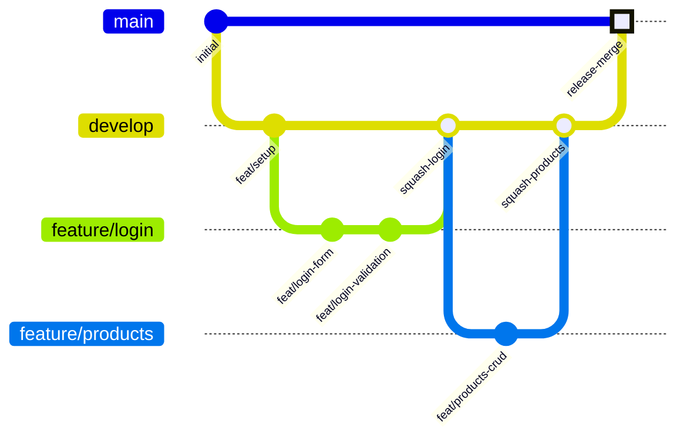

# Git Workflow

The operative workflow for the team. Maintain this in step with the team's actual practices — drift between this doc and `CONTRIBUTING.md` is a bug (and `CONTRIBUTING.md` is now a thin index; this file is the source of truth).

## Repository structure

```
.
├── frontend/               # Angular 18.2.0 application (target: 22)
├── backend/                 # NestJS API (git subtree)
├── docs/                    # Architecture, workflow, security, traceability
├── docker-compose.yml       # Orchestration
└── README.md
```

Per the original `CONTRIBUTING.md` (now an index), this is a monorepo-style project with `frontend/` and `backend/`.

## Branch strategy



### Branch types

| Prefix | Purpose | Example |
|--------|---------|---------|
| `feature/` | New functionality | `feature/user-auth` |
| `feat/` | Same as `feature/` (alias) | `feat/shopping-cart` |
| `chore/` | Maintenance, dependencies | `chore/update-deps` |
| `fix/` | Bug fixes | `fix/login-redirect` |
| `docs/` | Documentation only | `docs/api-docs` |
| `refactor/` | Code restructuring | `refactor/services` |

### Branch naming

```
<type>/<short-description>
feature/user-authentication
chore/update-angular-22
fix/category-delete-error
```

## Merge strategy

> **All merges into `develop` and `main` happen through a Pull Request.** Nobody pushes directly to either branch, even if they know the equivalent git command.

### feature → develop: Squash merge

1. Open PR from `feature/...` to `develop`.
2. GitHub: **"Squash and merge"**.
3. Edit the squash commit message to follow Conventional Commits.

```bash
git checkout develop
git merge --squash feature/my-feature
git commit -m "feat: my feature description"
```

**Why squash?** Keeps `develop`'s history clean while preserving granular commits in the feature branch.

### develop → main: Merge commit (`--no-ff`)

Release from `develop` into `main` use a **real merge commit**, never squash or rebase.

```bash
gh pr create \
  --base main \
  --head develop \
  --title "sync: merge develop into main" \
  --body "Regular develop → main sync. Merge commit (not squash) to preserve shared history."

gh pr merge <PR_NUMBER> --merge
```

```bash
git checkout main
git merge --no-ff develop -m "Release: v1.0"
git tag -a v1.0 -m "Version 1.0 release"
git push origin main --tags
```

**Why `--no-ff`?** It creates a merge commit that clearly marks the release boundary.

## Branch protection

Currently configured (per issue #48):

- `main`: requires 1 approval + CI green + no force-push.
- `develop`: requires 1 approval + no force-push.

Rules are enforced by GitHub at the repo level. Update them under **Settings → Branches** in the GitHub repo.

## Commit message format

```
<type>: <short description>

[optional body with more details]
```

Examples:
```
feat: add JWT interceptor for auth
fix: redirect loop on 401 response
chore: update Angular to 22.1
docs: add API endpoint documentation
```

`Closes #N` in the body auto-closes the issue on merge.

## Working with backend subtree

The `backend/` directory is a git subtree pointing to `carlosdcastano/gestion-de-productos`.

### Why a subtree (not a vendored folder)

One-week project; upstream is expected to gain 1-2 commits (small fixes) during the sprint. Subtree keeps a one-command way to pull them.

### Pulling upstream

```bash
git remote add backend-origin https://github.com/carlosdcastano/gestion-de-productos.git
git fetch backend-origin
git subtree pull --prefix=backend backend-origin main --squash
```

### Local edits

Direct edits to `backend/` (Supabase compat, Docker orchestration) are expected and fine. They are **not** being contributed back to `gestion-de-productos`, so `backend/` will diverge from upstream over time — expected for this project.

When editing `backend/` for any other reason, **don't refactor unrelated code** — keep the diff minimal so future subtree pulls stay clean.

## Pull Request checklist

Before opening PR:

- [ ] Branch name follows convention (`feature/`, `chore/`, etc.)
- [ ] Commits follow Conventional Commits
- [ ] PR description explains **what** and **why**, not just "fixed stuff"
- [ ] All tests pass (if applicable)
- [ ] No `console.log` or debug code left behind
- [ ] No secrets committed (real API keys, JWT secrets, DB URLs)
- [ ] If introducing a new dependency, see `docs/architecture.md` § Dep updates + decision-compliance skill
- [ ] If the change affects another integrator's code, that integrator is pinged for review
- [ ] Correct merge strategy: **Squash** for feature → develop, **Merge commit** for develop → main

## Review process

The team is flat for frontend code. The reviewer is:

1. The integrator whose code is affected (per the issue tracker), if the change touches their code.
2. Otherwise, any teammate with time — `SrLampi1001` is the preferred general reviewer.
3. The incident-response reviewer (for security/CI/governance changes) is `SrLampi1001`.

Carlos is the **stakeholder** (activity owner). He does not review code.

## Quick reference

| Action | How |
|--------|-----|
| Create feature branch | `git checkout -b feature/my-feature` |
| Merge feature → develop | Open PR, "Squash and merge" |
| Merge develop → main (release) | Open PR, "Create a merge commit" |
| Update backend subtree | `git subtree pull --prefix=backend backend-origin main --squash` |
| Check subtree status | `git log --oneline --graph --decorate --all` |
